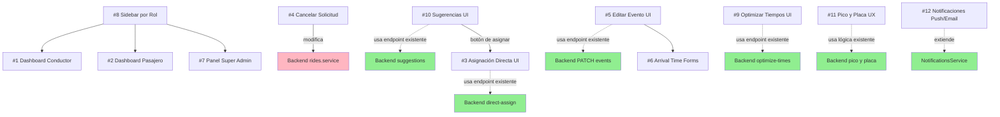

# Brecha de Implementación — RideFlow AI

> Documento completo de todo lo que falta, organizado para que agentes lo tomen y ejecuten en otra sesión.
> Cada sección es un work unit independiente a menos que se especifique dependencia.

---

## 📋 Índice de Trabajos

| # | Trabajo | Prioridad | Depende de | Backend Listo | Frontend |
|---|---------|-----------|------------|---------------|----------|
| 1 | Dashboard de Conductor | 🔴 Alta | — | Parcial | Nuevo |
| 2 | Dashboard de Pasajero | 🔴 Alta | — | Parcial | Nuevo |
| 3 | Asignación Directa (UI) | 🔴 Alta | — | ✅ Completo | Nuevo |
| 4 | Cancelar Solicitud (Pasajero) | 🟡 Media | — | ✅ Backend | Nuevo |
| 5 | Editar Evento (UI) | 🟡 Media | — | ✅ Endpoint | Nuevo |
| 6 | Arrival Time en Formularios | 🟡 Media | #5 | ✅ En BD | Modificar |
| 7 | Panel Super Admin | 🟡 Media | — | Parcial | Nuevo |
| 8 | Sidebar por Rol | 🟡 Media | — | — | Modificar |
| 9 | Optimizar Tiempos (UI) | 🟢 Baja | — | ✅ Endpoint | Nuevo |
| 10 | Sugerencias de Conductores | 🟢 Baja | — | ✅ Endpoint | Nuevo |
| 11 | Pico y Placa - UX | 🟢 Baja | — | ✅ Backend | Modificar |
| 12 | Notificaciones Push/Email | 🟢 Baja | — | ❌ Nuevo | ❌ Nuevo |

---

## Trabajo #1: Dashboard de Conductor

### Estado Actual
No existe una vista consolidada para conductores. El conductor tiene que navegar a cada evento manualmente para ver sus viajes asignados.

### Lo que YA existe (no construir de nuevo)

**Backend:**
- `GET /api/dashboard/stats` — KPIs globales (activeEvents, totalParticipants, tripsToday, pendingRequests, vehicleUtilization)
- `GET /api/events/:organizationId/events` — eventos por org
- `GET /api/events/:eventId/trips` — viajes de un evento (filtrables por driver)
- `GET /api/events/:eventId/trips/:tripId` — detalle de viaje
- `POST /api/events/:eventId/vehicles` — registrar vehículo en evento
- `PATCH /api/events/:id/status` — cambiar estado de evento

**Frontend:**
- Componentes UI: `Card`, `Badge`, `Button`, `Skeleton`, `PageContainer`
- Hooks: `useSession()`, `useDashboardStats()`, `useEventTrips()`, `useTrip()`
- Mapa: `MapView` con Leaflet
- Layout auth: sidebar + navbar

### Qué construir

**Ruta:** `/driver/dashboard` (nueva página protegida por middleware)

**Funcionalidad:**
1. **Mis viajes de hoy** — lista de viajes donde el usuario logueado es `driver_id`, filtrados por eventos de la fecha actual
2. **Próximos eventos** — eventos donde el conductor tiene EventVehicle registrado, ordenados por fecha
3. **KPIs del conductor:**
   - Viajes asignados hoy
   - Pasajeros totales asignados
   - Próximo viaje (hora de salida + destino)
4. **Acciones rápidas:**
   - Ver detalle del viaje → `/events/:id/trips/:tripId`
   - Cambiar estado del evento si es OPEN → botón "Cerrar evento"
   - Compartir QR del evento

### API Calls específicas

```
GET /api/session → memberships → organizations → events
GET /api/organizations/:id/events → eventos de cada org
  → filtrar eventos donde el user tiene event_vehicles registrados
GET /api/events/:id/trips → viajes del evento
  → filtrar trips donde trip.driver_id === user.id
GET /api/events/:id → detalle del evento para mostrar origen/destino/status
```

### Criterio de Aceptación
- [ ] Ruta `/driver/dashboard` existe y es accesible solo con auth
- [ ] Muestra viajes del día del conductor logueado
- [ ] Muestra KPIs relevantes
- [ ] Tiene enlaces a detalle de viaje
- [ ] Sidebar navega a esta ruta (ver Trabajo #8)

### Archivos a crear
- `frontend/src/app/(dashboard)/driver/dashboard/page.tsx`
- `frontend/src/lib/queries/driver.ts` (nuevos hooks)

### Archivos a modificar
- `frontend/src/middleware.ts` — agregar `/driver` a protectedPaths
- `frontend/src/app/(dashboard)/layout.tsx` — agregar nav item (condicional por rol, ver #8)

---

## Trabajo #2: Dashboard de Pasajero

### Estado Actual
No existe una vista consolidada para pasajeros. El pasajero tiene que entrar a cada evento para ver si su solicitud fue aceptada.

### Lo que YA existe

**Backend:**
- `GET /api/events/:eventId/requests` — solicitudes de un evento
- `GET /api/events/:eventId/trips/:tripId` — detalle del viaje
- `POST /api/events/:eventId/requests` — crear solicitud

**Frontend:**
- `useEventRequests()`, `useTrip()`
- Componentes UI existentes

### Qué construir

**Ruta:** `/passenger/dashboard`

**Funcionalidad:**
1. **Mis solicitudes activas** — ride_requests donde `passenger_id === user.id` que están PENDING o ACCEPTED
2. **Mis viajes asignados** — viajes donde el usuario tiene PassengerAssignment, con enlace a detalle
3. **Eventos disponibles** — eventos OPEN de sus organizaciones donde NO ha solicitado aún, con botón "Solicitar viaje"
4. **Estados visibles:**
   - PENDING → "Esperando aprobación" (badge amarillo)
   - ACCEPTED → "✅ Asignado al viaje de [conductor]" con enlace al detalle
   - REJECTED → "❌ Rechazado" con posibilidad de solicitar de nuevo
5. **Botón de cancelar** en solicitudes PENDING (ver Trabajo #4)

### API Calls específicas

```
GET /api/session → memberships
GET /api/organizations/:id/events → eventos
  → crear un hook que cruce user.id con ride_requests para mostrar estado
```

**Nota:** No existe un endpoint `GET /api/users/:id/requests` global. Hay dos opciones:
- Opción A (rápida): crear un endpoint nuevo en backend `GET /api/my-requests` que devuelva todas las ride_requests del usuario
- Opción B (sin backend): recorrer eventos de cada org y llamar `GET /events/:id/requests`, filtrar por `passenger_id === user.id`

### Criterio de Aceptación
- [ ] Ruta `/passenger/dashboard` existe
- [ ] Muestra solicitudes activas del pasajero con su estado
- [ ] Muestra viajes asignados con enlace a detalle
- [ ] Muestra eventos disponibles para solicitar
- [ ] Botón de cancelar en PENDING (ver #4)

### Archivos a crear
- `frontend/src/app/(dashboard)/passenger/dashboard/page.tsx`
- `frontend/src/lib/queries/passenger.ts`

### Archivos a modificar
- `frontend/src/middleware.ts`
- `frontend/src/app/(dashboard)/layout.tsx`

---

## Trabajo #3: Asignación Directa (UI)

### Estado Actual
El endpoint `POST /api/events/:eventId/direct-assign` está implementado en backend y funciona. No hay botón ni UI en frontend.

### Backend endpoint (NO TOCAR)
```typescript
POST /events/:eventId/direct-assign
Auth: @Roles(ORG_ADMIN, DRIVER)
Body: { passengerId: string, driverId: string }
Response: Trip completo con asignación
```
El endpoint:
- Verifica que quien asigna tiene rol ORG_ADMIN o DRIVER en la org
- Busca la ride_request del pasajero (PENDING o ACCEPTED, no REJECTED/CANCELLED)
- Verifica que el pasajero no esté ya asignado a un trip
- Busca un vehículo activo del driver
- Crea un Trip con el driver + vehículo
- Crea PassengerAssignment
- Actualiza RideRequest a ACCEPTED (si estaba PENDING)
- Envía notificación TRIP_ASSIGNED

### Qué construir en frontend

**Dónde:** Página `/events/:id/requests` — agregar columna/botón "Asignar a conductor"

**Modal de asignación directa:**

```
┌─────────────────────────────────────┐
│ Asignar pasajero a conductor        │
│                                     │
│ Pasajero: [nombre del pasajero]     │
│                                     │
│ Conductor: [SELECT con conductores  │
│            disponibles del evento]  │
│                                     │
│  [Cancelar]  [✓ Asignar]            │
└─────────────────────────────────────┘
```

**Detalles:**
1. En la tabla de solicitudes, junto a cada PENDING, agregar botón "Asignar a..."
2. Modal/desplegable que muestra lista de conductores que tienen EventVehicle registrado en el evento
3. Al seleccionar conductor y confirmar → `POST /events/:eventId/direct-assign` con `{ passengerId, driverId }`
4. Mostrar toast de éxito/error
5. Refrescar la tabla de solicitudes

**API para obtener conductores disponibles:**
```
GET /api/events/:eventId/vehicles → event_vehicles con driver info
```
Ya existe en `event-vehicles.controller.ts` -> `GET events/:eventId/vehicles` (público con auth)

### Criterio de Aceptación
- [ ] Botón "Asignar a conductor" aparece en solicitudes PENDING para ORG_ADMIN/DRIVER
- [ ] Modal muestra lista de conductores registrados en el evento
- [ ] Asignación funciona y crea el viaje correctamente
- [ ] Pasajero recibe notificación
- [ ] La tabla se actualiza después de la asignación

### Archivos a modificar
- `frontend/src/app/(dashboard)/events/[id]/requests/page.tsx`
- Posiblemente: `frontend/src/lib/queries/rides.ts` (nuevo mutation hook)

---

## Trabajo #4: Cancelar Solicitud (Pasajero)

### Estado Actual
El backend acepta `PATCH /api/requests/:id { status: "CANCELLED" }` pero no hay botón en frontend para que el pasajero cancele.

### Backend endpoint (NO TOCAR)
```typescript
PATCH /requests/:id
Auth: AuthGuard
Body: { status: "CANCELLED" }
```
**Comportamiento existente:**
- Verifica que quien cancela tiene rol ORG_ADMIN, DRIVER, o SUPER_ADMIN en la org
- Valida transiciones: PENDING → CANCELLED o ACCEPTED → CANCELLED
- Si se cancela un ACCEPTED, llama a `handleCancellationReoptimization` que re-optimiza tiempos OSRM
- Notifica al pasajero

**⚠️ ISSUE:** El endpoint requiere ORG_ADMIN/DRIVER/SUPER_ADMIN para cancelar. El pasajero NO puede cancelar su propia solicitud porque no tiene ese rol en la org. Hay que modificar el backend para permitir que el `passenger_id` de la solicitud también pueda cancelar.

### Cambio necesario en backend

**Archivo:** `backend/src/rides/rides.service.ts`, método `updateRequestStatus`

Agregar al bloque de verificación de permisos (línea 141):
```typescript
// Permitir que el pasajero cancele su propia solicitud
const isOwnCancellation =
  request.passenger_id === userId &&
  dto.status === RequestStatus.CANCELLED;

if (!authorizer && !isOwnCancellation) {
  throw new ForbiddenException('...');
}

// Si no es el pasajero, verificar rol
if (!isOwnCancellation && (
  !authorizer ||
  (authorizer.role !== Role.ORG_ADMIN &&
    authorizer.role !== Role.DRIVER &&
    authorizer.role !== Role.SUPER_ADMIN)
)) {
  throw new ForbiddenException('...');
}
```

También modificar transiciones válidas para permitir PENDING → CANCELLED (ya lo permite) y ACCEPTED → CANCELLED (ya lo permite).

### Qué construir en frontend

**Dónde:**
1. Página `/events/:id/requests` — botón "Cancelar" para el pasajero dueño de la solicitud
2. (Opcional) Dashboard de pasajero #2 — botón de cancelar desde ahí

**Botón:** "Cancelar solicitud" con confirmación:
```
¿Cancelar solicitud?
Se eliminará tu solicitud de viaje para este evento.
[No] [Sí, cancelar]
```

### Criterio de Aceptación
- [ ] Backend: pasajero puede cancelar su propia solicitud PENDING (modo código)
- [ ] Frontend: botón "Cancelar" visible solo para el dueño de la solicitud
- [ ] Confirmación antes de cancelar
- [ ] Solicitud cambia a CANCELLED y se actualiza la UI

### Archivos a modificar
- `backend/src/rides/rides.service.ts` — modificar verificación de permisos
- `frontend/src/app/(dashboard)/events/[id]/requests/page.tsx` — agregar botón de cancelar

---

## Trabajo #5: Editar Evento (UI)

### Estado Actual
El endpoint `PATCH /api/events/:id` existe y acepta `UpdateEventDto`. La página de detalle del evento NO tiene formulario de edición, solo muestra los datos en modo lectura.

### Backend endpoint (NO TOCAR)
```typescript
PATCH /events/:id
Auth: @Roles(ORG_ADMIN, DRIVER)
Body: UpdateEventDto
  - title?: string
  - description?: string
  - date?: string (ISO)
  - origin?: string
  - destination?: string
  - originLat?: number
  - originLng?: number
  - destLat?: number
  - destLng?: number
  - capacity?: number
  - arrivalTime?: string (ISO)
```

### Qué construir

**Dónde:** Página `/events/:id` — agregar botón "Editar" que abre modal o toggle form

**Condiciones:**
- Solo eventos en estado DRAFT o PUBLISHED son editables (validación del backend)
- Solo visible para ORG_ADMIN y DRIVER

**Funcionalidad:**
1. Botón "Editar" en la cabecera del evento (junto al status badge)
2. Modal o toggle con formulario pre-poblado con datos actuales
3. Campos editables: título, descripción, fecha, origen, destino, capacidad, arrivalTime
4. Guardar → `PATCH /events/:id`
5. Actualizar la UI sin recargar página

### Criterio de Aceptación
- [ ] Botón "Editar" visible para ORG_ADMIN/DRIVER en eventos DRAFT/PUBLISHED
- [ ] Formulario pre-poblado con datos actuales
- [ ] Guardar funciona y actualiza la página
- [ ] Llegada (arrivalTime) incluida en el formulario (ver #6)

### Archivos a modificar
- `frontend/src/app/(dashboard)/events/[id]/page.tsx` — agregar modal/form de edición

---

## Trabajo #6: Arrival Time en Formularios

### Estado Actual
El campo `arrivalTime` existe en la tabla `events` y se muestra en detalle si está seteado, pero el formulario de crear evento (`/events/new`) no tiene input para arrivalTime.

### Lo que YA existe

**Backend:**
- `events.arrival_time` en BD
- Campo en `CreateEventDto` y `UpdateEventDto`
- Se muestra en `EventDetailPage` si existe

**Frontend:**
- `/events/new/page.tsx` — formulario de creación sin el campo

### Qué modificar

**Archivo:** `frontend/src/app/(dashboard)/events/new/page.tsx`

Agregar campo:
```tsx
<div>
  <label>Hora de llegada al destino</label>
  <input type="datetime-local" ... />
  <p className="text-xs text-text-muted">
    Usado para calcular hora de salida de conductores y tiempos de recogida.
  </p>
</div>
```

También agregar el campo al formulario de editar evento (Trabajo #5).

### Criterio de Aceptación
- [ ] Formulario de nuevo evento incluye input para arrivalTime
- [ ] Formulario de editar evento también lo incluye
- [ ] Al guardar, arrivalTime se persiste correctamente
- [ ] Se muestra en detalle del evento

### Archivos a modificar
- `frontend/src/app/(dashboard)/events/new/page.tsx`
- `frontend/src/app/(dashboard)/events/[id]/page.tsx` (edición, trabajo #5)

---

## Trabajo #7: Panel Super Admin

### Estado Actual
El rol `SUPER_ADMIN` existe en el enum de Prisma y en el seed data, pero no hay ninguna UI específica. Un SUPER_ADMIN ve el mismo dashboard que todos.

### Lo que YA existe

**Backend:**
- `GET /api/dashboard/stats` — stats globales
- `GET/POST/PATCH/DELETE /organizations` — CRUD completo
- `PATCH /organizations/:orgId/users/:userId/role` — cambiar roles
- `DELETE /events/:id` — eliminar evento (solo ORG_ADMIN)

**⚠️ Lo que FALTA en backend:**
- No hay endpoint para listar TODOS los usuarios del sistema
- No hay endpoint para listar TODOS los eventos (sin filtrar por org)
- No hay stats de actividad del sistema

### Qué construir

**Backend (endpoints nuevos):**
```typescript
GET /api/admin/users
  Auth: @Roles(SUPER_ADMIN)
  Returns: todos los usuarios del sistema con sus memberships
  
GET /api/admin/stats
  Auth: @Roles(SUPER_ADMIN)
  Returns: stats detalladas (total orgs, total users, total events, etc.)
  
DELETE /api/admin/users/:id
  Auth: @Roles(SUPER_ADMIN)
  Returns: eliminar usuario (o desactivar)
```

**Frontend (ruta: `/admin`):**
1. **Panel de control global:**
   - Total organizaciones, usuarios, eventos, viajes
   - Gráfica de actividad (eventos por mes)
2. **Gestión de organizaciones:**
   - Lista completa con filtro y búsqueda
   - Crear/eliminar desde el panel
3. **Gestión de usuarios:**
   - Lista de todos los usuarios
   - Ver memberships por usuario
   - Cambiar rol globalmente
4. **Logs de actividad** (opcional, fase 2)

### Criterio de Aceptación
- [ ] Endpoints de admin implementados con @Roles(SUPER_ADMIN)
- [ ] Ruta `/admin` existe y solo accesible para SUPER_ADMIN
- [ ] Panel muestra stats globales
- [ ] Puede listar y gestionar organizaciones
- [ ] Puede listar y gestionar usuarios

### Archivos a crear
- `backend/src/admin/admin.controller.ts`
- `backend/src/admin/admin.service.ts`
- `backend/src/admin/admin.module.ts`
- `frontend/src/app/(dashboard)/admin/page.tsx`
- `frontend/src/app/(dashboard)/admin/users/page.tsx`
- `frontend/src/app/(dashboard)/admin/organizations/page.tsx`
- `frontend/src/lib/queries/admin.ts`

### Archivos a modificar
- `backend/src/app.module.ts` — importar AdminModule
- `frontend/src/middleware.ts`
- `frontend/src/app/(dashboard)/layout.tsx`

---

## Trabajo #8: Sidebar por Rol

### Estado Actual
El sidebar en `layout.tsx` muestra los mismos items para todos los usuarios autenticados: Dashboard, Organizaciones, Eventos, Vehículos, Notificaciones.

### Lo que YA existe
- `useSession()` devuelve `memberships` con `{ organization, role }`
- El usuario puede tener múltiples roles en diferentes orgs

### Qué construir

**Lógica de visibilidad (resolver el rol "efectivo" del usuario):**
```
Si user tiene SUPER_ADMIN en alguna org → mostrar items de SUPER_ADMIN + todos
Si user tiene ORG_ADMIN en alguna org → mostrar items de ORG_ADMIN + DRIVER + PASSENGER
Si user tiene DRIVER en alguna org → mostrar items de DRIVER + PASSENGER
Si user tiene solo PASSENGER → mostrar solo items de PASSENGER
```

**Items del sidebar por rol:**

| Ítem | PASSENGER | DRIVER | ORG_ADMIN | SUPER_ADMIN |
|------|-----------|--------|-----------|-------------|
| Dashboard global | ✅ | ✅ | ✅ | ✅ |
| Mi Viaje (Pasajero) | ✅ | — | — | — |
| Conducir (Driver) | — | ✅ | — | — |
| Organizaciones | ✅ | ✅ | ✅ | ✅ |
| Eventos | ✅ | ✅ | ✅ | ✅ |
| Vehículos | — | ✅ | ✅ | ✅ |
| Admin (Super Admin) | — | — | — | ✅ |
| Notificaciones | ✅ | ✅ | ✅ | ✅ |

**Dónde modificar:**

En `layout.tsx`, la lógica de `navItems` debe ser dinámica:
```typescript
const { data: session } = useSession();
const roles = session?.memberships?.map(m => m.role) ?? [];
const effectiveRole = resolveEffectiveRole(roles); // devuelve el rol más alto

const navItems = [
  ...baseItems,  // Dashboard siempre visible
  ...(effectiveRole === 'PASSENGER' ? [{ label: 'Mi Viaje', href: '/passenger/dashboard', icon: ... }] : []),
  ...(effectiveRole === 'DRIVER' || effectiveRole === 'ORG_ADMIN' || effectiveRole === 'SUPER_ADMIN'
    ? [{ label: 'Conducir', href: '/driver/dashboard', icon: ... }] : []),
  ...(effectiveRole === 'SUPER_ADMIN' ? [{ label: 'Admin', href: '/admin', icon: ... }] : []),
  // Organizaciones, Eventos, Vehículos, Notificaciones siempre visibles por ahora
];
```

### Criterio de Aceptación
- [ ] PASSENGER ve item "Mi Viaje" que lleva a /passenger/dashboard
- [ ] DRIVER ve item "Conducir" que lleva a /driver/dashboard
- [ ] SUPER_ADMIN ve item "Admin" que lleva a /admin
- [ ] ORG_ADMIN ve items de DRIVER
- [ ] Items base (Dashboard, Organizaciones, Eventos, Notificaciones) visibles para todos

### Archivos a modificar
- `frontend/src/app/(dashboard)/layout.tsx` — sidebar dinámico

---

## Trabajo #9: Optimizar Tiempos (UI)

### Estado Actual
`POST /api/events/:id/optimize-times` existe en backend. Se llama automáticamente cuando se cancela una solicitud ACCEPTED. No hay botón manual en UI.

### Backend endpoint (NO TOCAR)
```typescript
POST /events/:id/optimize-times
Auth: AuthGuard
Body: (ninguno — usa event.arrivalTime + trip waypoints)
Response: {
  trips: [{
    tripId,
    estimatedDepartureTime,
    pickupTimes: [{ passengerId, pickupTime, pickupOrder }]
  }]
}
```

**Comportamiento:**
- Requiere que el evento tenga `arrivalTime` seteado
- Para cada trip del evento, construye waypoints: `[driverStart → passengerPickups → destination]`
- Llama a OSRM para obtener duración de cada segmento
- Calcula departureTime = arrivalTime - sum(segmentDurations)
- Calcula pickupTime por pasajero
- Guarda estimatedDepartureTime en Trip y estimatedPickupTime en PassengerAssignment
- Si OSRM no está disponible: fallback 5 min por segmento

### Qué construir

**Dónde:** Página `/events/:id/trips` — botón "Optimizar tiempos de recogida"

**Condiciones:**
- Solo visible si el evento tiene arrivalTime seteado
- Solo visible para ORG_ADMIN y DRIVER
- Ocultar si no hay trips creados

**Botón:**
```
[🔄 Optimizar tiempos de recogida]
```
Al hacer clic:
1. Llamar `POST /events/:id/optimize-times`
2. Mostrar spinner mientras se procesa
3. Mostrar resultado: "Tiempos optimizados para N viajes"
4. Mostrar resumen de tiempos calculados

**⚠️ Requisito:** Asegurar que el evento tenga `arrivalTime` (ver #6).

### Criterio de Aceptación
- [ ] Botón visible en trips page para ORG_ADMIN/DRIVER
- [ ] Solo visible cuando evento tiene arrivalTime
- [ ] Llama al endpoint y muestra resultado
- [ ] Los tiempos actualizados se reflejan en detalle de viaje

### Archivos a modificar
- `frontend/src/app/(dashboard)/events/[id]/trips/page.tsx`

---

## Trabajo #10: Sugerencias de Conductores (UI)

### Estado Actual
`GET /api/events/:id/suggestions` existe en backend y devuelve un ranking de conductores por pasajero basado en distancia Haversine. No hay frontend que muestre esto.

### Backend endpoint (NO TOCAR)
```typescript
GET /events/:id/suggestions
Auth: AuthGuard
Response: [
  {
    passenger: { id, name, email, pickupLat, pickupLng },
    rankedDrivers: [{
      driver: { id, name },
      vehicle: { model, plate, capacity },
      distance: number,    // km (Haversine)
      startLocation: string
    }]
  }
]
```

### Qué construir

**Dónde:** Página `/events/:id/requests` — pestaña/sección "Sugerencias"

**Funcionalidad:**
1. Para cada pasajero PENDING, mostrar los conductores rankeados por cercanía
2. Tarjeta por pasajero con:
   - Nombre del pasajero y dirección de recogida
   - Lista de conductores sugeridos con distancia, vehículo
3. Botón "Asignar" que usa asignación directa (ver #3) con el conductor seleccionado

### Criterio de Aceptación
- [ ] Página/section muestra sugerencias por pasajero
- [ ] Conductores rankeados por distancia
- [ ] Botón de asignar directa desde sugerencia
- [ ] Solo visible para ORG_ADMIN/DRIVER

### Archivos a crear
- Podría ser un modal o sección en `/events/:id/requests/page.tsx`
- O una página nueva: `/frontend/src/app/(dashboard)/events/[id]/suggestions/page.tsx`

---

## Trabajo #11: Pico y Placa — UX Completa

### Estado Actual
El pico y placa se calcula al registrar un vehículo en un evento (en `invitations.service.ts`). Se guarda como `event_vehicles.pico_y_placa` (boolean). En el frontend, se muestra un badge "Pico y placa" en rojo en el detalle del evento. No hay:
- Advertencia ANTES de registrar el vehículo
- Explicación de qué significa
- Sugerencia de alternativa

### Lo que YA existe

**Backend:**
- `checkPicoYPlaca()` en `invitations.service.ts` — lógica basada en último dígito de placa + día de semana
- `GET /event-vehicles/:id/pico-y-placa` — endpoint de consulta
- `event_vehicles.pico_y_placa` — campo boolean

**Frontend:**
- Badge "Pico y placa" rojo en `events/[id]/page.tsx`

### Qué modificar

**1. Advertencia al registrar vehículo en evento (invite flow):**
En `frontend/src/app/invite/[token]/page.tsx`, después de seleccionar vehículo y antes de enviar:
- Si el vehículo tiene placa, mostrar aviso: "⚠️ Este vehículo tiene pico y placa el día del evento"
- Opcional: calendario visual mostrando qué días aplica

**2. Panel de vehículo con restricciones:**
En `frontend/src/app/(dashboard)/vehicles/[id]/page.tsx`:
- Mostrar días de pico y placa para este vehículo según su placa

### Criterio de Aceptación
- [ ] Al unirse como conductor, si el vehículo tiene pico y placa, se muestra advertencia antes de confirmar
- [ ] Badge en detalle de vehículo mostrando restricción
- [ ] En detalle de evento, badge existente se mantiene

### Archivos a modificar
- `frontend/src/app/invite/[token]/page.tsx` — advertencia pre-submit
- `frontend/src/app/(dashboard)/vehicles/[id]/page.tsx` — info de pico y placa

---

## Trabajo #12: Notificaciones Push/Email

### Estado Actual
Solo hay notificaciones in-app (tabla `notifications`, endpoint `GET /notifications`, badge de conteo). No hay integración con email ni push notifications.

### Lo que YA existe

**Backend:**
- `NotificationsService` con método `create({ type, title, message, userId })`
- Tipos: `RIDE_REQUESTED`, `RIDE_APPROVED`, `RIDE_REJECTED`, `RIDE_CANCELLED`, `TRIP_ASSIGNED`, `EVENT_VEHICLE_REGISTERED`, `ESTIMATED_PICKUP_TIME`, `EVENT_REMINDER`
- Se llama desde: `rides.service.ts`, `invitations.service.ts`

**Frontend:**
- Página `/notifications`
- Badge de no leídas en sidebar
- `useUnreadCount()` hook

### Qué construir

**Backend:**

1. **Configurar servicio de email** (Resend, SendGrid, o Supabase built-in email):
   ```typescript
   // EmailService
   async sendEmail(to: string, subject: string, html: string)
   ```

2. **Configurar push notifications** (Firebase Cloud Messaging o similar):
   ```typescript
   // PushService
   async sendPush(userId: string, title: string, body: string)
   ```
   - Requiere registrar device tokens por usuario
   - Tabla nueva: `user_device_tokens`

3. **Integrar con NotificationsService existente:**
   ```typescript
   // Al crear notificación, también enviar email/push
   async create(dto) {
     // guardar en BD (existe)
     // enviar email (nuevo)
     // enviar push (nuevo)
   }
   ```

4. **Preferencias de notificación por usuario** (opcional):
   - Tabla `notification_preferences`
   - Permitir configurar qué tipo de notificaciones recibir por qué canal

**Frontend:**

1. **Suscribir service worker** para push:
   ```typescript
   // en providers.tsx o un nuevo NotificationProvider
   if ('serviceWorker' in navigator && 'PushManager' in window) {
     // registrar SW y obtener push token
     // enviar token al backend
   }
   ```

### Criterio de Aceptación
- [ ] Email enviado al crear notificación (al menos para RIDE_APPROVED y TRIP_ASSIGNED)
- [ ] Push notification enviada si el usuario tiene device token registrado
- [ ] Preferencias de notificación configurables (MVP: checkbox email/push)
- [ ] Service worker registrado en frontend

### Archivos a crear
- `backend/src/email/email.service.ts`
- `backend/src/email/email.module.ts`
- `backend/src/push/push.service.ts`
- `backend/src/push/push.module.ts`
- `backend/src/notification-preferences/...` (opcional)
- `frontend/public/sw.js`
- `frontend/src/lib/push-service.ts`

### Archivos a modificar
- `backend/src/notifications/notifications.service.ts` — integrar email + push
- `backend/src/app.module.ts`
- `frontend/src/app/providers.tsx`

---

## 📐 Dependencias entre trabajos



**Leyenda:**
- ✅ Verde = Backend listo, solo falta frontend
- 🔴 Rojo = Backend necesita cambios también
- Las flechas indican dependencia (lo de arriba debe estar listo primero)

---

## 🚀 Orden sugerido de implementación

### Fase 1 — Impacto rápido (sin backend nuevo)
1. #6 Arrival Time en formularios
2. #5 Editar Evento UI
3. #4 Cancelar Solicitud (pasajero) — requiere 1 cambio menor en backend
4. #3 Asignación Directa UI

### Fase 2 — Dashboards por rol
5. #1 Dashboard Conductor
6. #2 Dashboard Pasajero
7. #8 Sidebar por Rol

### Fase 3 — Utilidades
8. #9 Optimizar Tiempos UI
9. #10 Sugerencias UI
10. #11 Pico y Placa UX

### Fase 4 — Escalamiento
11. #7 Panel Super Admin
12. #12 Notificaciones Push/Email

---

## Verbos para iniciar cada trabajo con un agente

Cuando quieras arrancar uno, usá prompts como:

> "Inicia SDD para implementar el dashboard de conductor. Usa la brecha de implementación en docs/brecha-implementacion.md, trabajo #1. Primero explorá la estructura actual de dashboards y componentes, luego proponé el enfoque."

> "Inicia SDD para el trabajo #3: frontend de asignación directa. El backend ya está listo, solo falta el modal y botón en la página de solicitudes. Revisá la página de requests existente y el endpoint POST /events/:eventId/direct-assign."

> "SDD para el trabajo #4: permitir que el pasajero cancele su solicitud. Necesita cambio en backend (rides.service.ts) para permitir que el passenger_id cancele, y botón en frontend."
