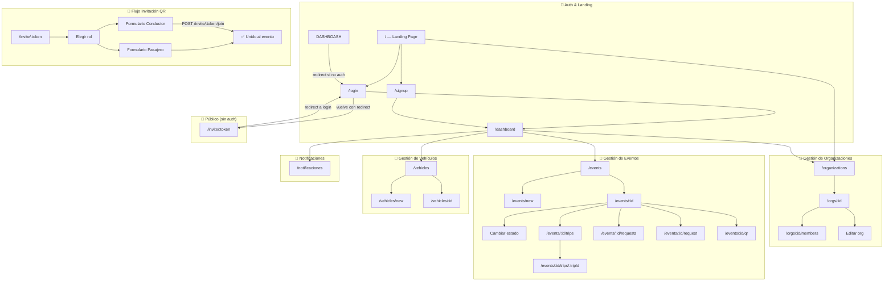
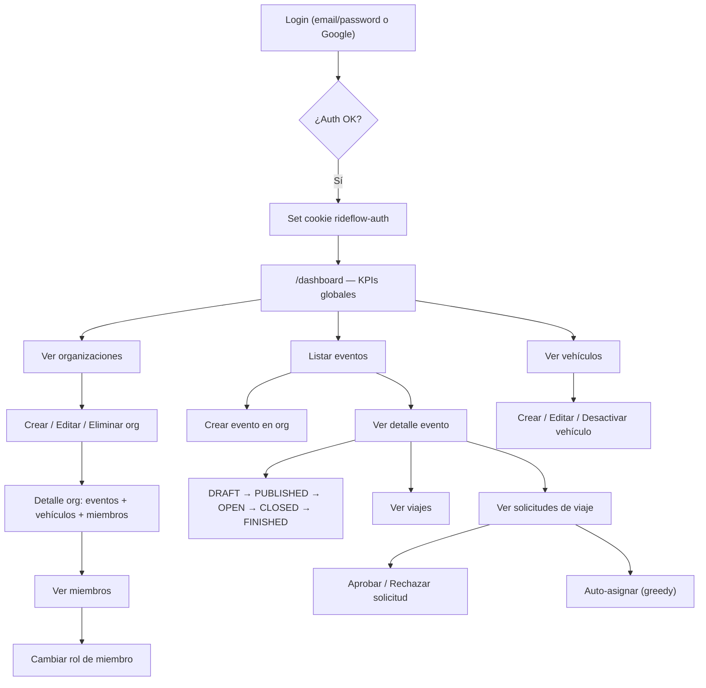
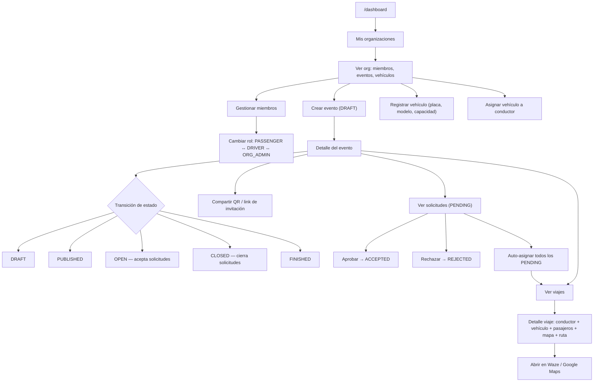
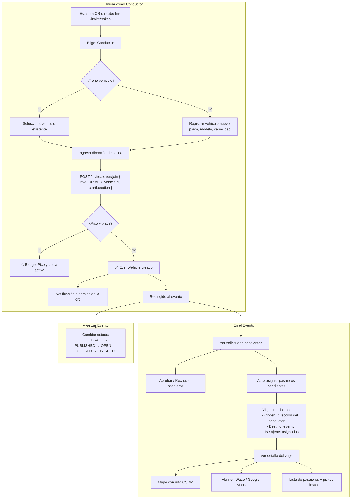
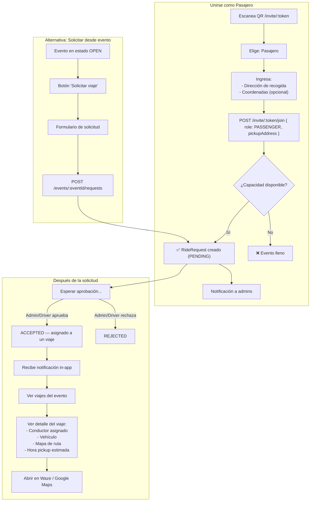
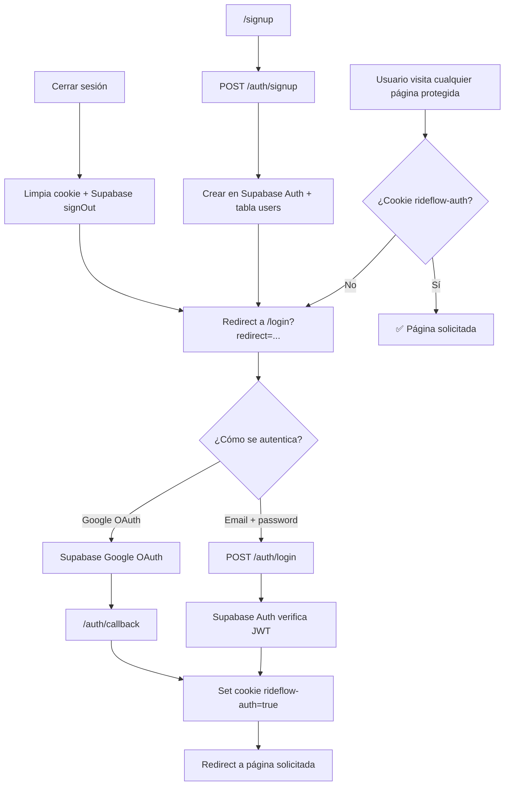
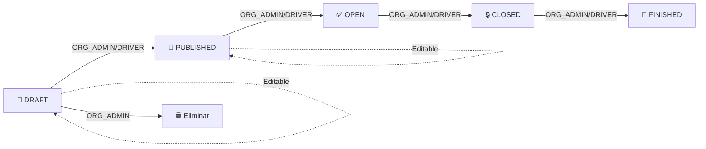
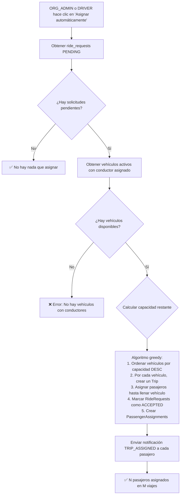
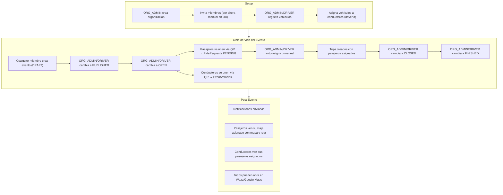

# Flujos Actuales por Rol — RideFlow AI

> ℹ️ **Nota**: la app tiene roles por organización. Un usuario puede tener distinto rol en cada org.

---

## Mapa General de la Aplicación

---

## 1. SUPER_ADMIN (Administrador Global)

### Lo que PUEDE hacer (implementado)

| Flujo | ¿Funciona? | Ruta |
|-------|-----------|------|
| Ver dashboard con KPIs globales | ✅ | `GET /dashboard/stats` |
| CRUD organizaciones | ✅ (crear, editar) | `POST/PATCH /organizations/:id` |
| Eliminar organización | ✅ (solo SUPER_ADMIN) | `DELETE /organizations/:id` |
| Ver miembros de org + cambiar roles | ✅ | `PATCH /orgs/:orgId/users/:userId/role` |
| CRUD vehículos en cualquier org | ✅ | `POST/PATCH/DELETE /vehicles` |
| CRUD eventos + transiciones de estado | ✅ | `POST/PATCH /events/:id/status` |
| Cambiar estado de solicitudes de viaje | ✅ | `PATCH /requests/:id` |
| Auto-asignar pasajeros a conductores | ✅ | `POST /events/:eventId/assign` |
| Asignación directa (backend) | ✅ Backend / ❌ Sin UI | `POST /events/:eventId/direct-assign` |
| Ver mapa con rutas Leaflet + OSRM | ✅ | `/events/:id/trips/:tripId` |

### Lo que NO está implementado

| Carencia | Detalle |
|----------|---------|
| **Panel de Super Admin** | No existe una vista global de todas las organizaciones, usuarios, o actividad del sistema |
| **Gestión de usuarios** | No hay forma de listar/editar/desactivar usuarios desde la UI |
| **Solo existe como rol en BD** | El enum `SUPER_ADMIN` está, pero no hay UI diferenciada |

### Diagrama de flujo SUPER_ADMIN

---

## 2. ORG_ADMIN (Administrador de Organización)

### Lo que PUEDE hacer (implementado)

| Flujo | ¿Funciona? | Permiso |
|-------|-----------|---------|
| Ver dashboard | ✅ | Auth |
| CRUD organización (editar nombre) | ✅ | `@Roles(SUPER_ADMIN, ORG_ADMIN)` en controller |
| CRUD eventos | ✅ | `@Roles(ORG_ADMIN, DRIVER, PASSENGER)` crear |
| Avanzar estado del evento | ✅ | `@Roles(ORG_ADMIN, DRIVER)` |
| Eliminar evento | ✅ (solo ORG_ADMIN) | `@Roles(ORG_ADMIN)` |
| CRUD vehículos de la org | ✅ | `@Roles(SUPER_ADMIN, ORG_ADMIN)` |
| Cambiar rol de miembros | ✅ (sin guard, check manual) | `PATCH .../users/:userId/role` |
| Ver solicitudes de viaje + gestionar | ✅ | `ALLOWED_ROLES = ['SUPER_ADMIN', 'ORG_ADMIN', 'DRIVER']` |
| Auto-asignar pasajeros | ✅ | `@Roles(ORG_ADMIN, DRIVER)` |
| Asignación directa (backend) | ✅ Backend / ❌ Sin UI | `POST direct-assign` |
| Registrar vehículo en evento | ✅ | `@Roles(DRIVER, ORG_ADMIN)` |
| Ver QR + compartir invitación | ✅ | Auth |
| Ver notificaciones | ✅ | Auth |
| Ver mapa del viaje con ruta | ✅ | Auth |

### Diagrama de flujo ORG_ADMIN

---

## 3. DRIVER (Conductor)

### Lo que PUEDE hacer (implementado)

| Flujo | ¿Funciona? | Permiso |
|-------|-----------|---------|
| Ver dashboard | ✅ | Auth |
| Unirse a evento vía QR como conductor | ✅ | `POST /invite/:token/join` |
| Seleccionar vehículo existente o crear nuevo | ✅ | Formulario en `/invite/:token` |
| Registrar vehículo en evento | ✅ | `@Roles(DRIVER, ORG_ADMIN)` |
| Ver pico y placa (badge) | ✅ | Se calcula al unirse |
| Crear eventos | ✅ | `@Roles(ORG_ADMIN, DRIVER, PASSENGER)` |
| Avanzar estado del evento | ✅ | `@Roles(ORG_ADMIN, DRIVER)` |
| Aprobar/rechazar solicitudes de viaje | ✅ | `ALLOWED_ROLES` incluye DRIVER |
| Auto-asignar pasajeros | ✅ | `@Roles(ORG_ADMIN, DRIVER)` |
| Ver viajes asignados | ✅ | `GET /events/:id/trips` |
| Ver detalle del viaje con mapa | ✅ | `/events/:id/trips/:tripId` |
| Editar info de evento | ✅ | `@Roles(ORG_ADMIN, DRIVER)` |
| Ver notificaciones | ✅ | Auth |

### Lo que NO está implementado

| Carencia | Detalle |
|----------|---------|
| **Dashboard de conductor** | No hay vista que muestre "mis viajes asignados", "mis pasajeros", "mi ruta del día" |
| **Vista de ruta optimizada** | El OSRM calcula la ruta pero no hay "ver mi ruta completa con paradas" desde la perspectiva del conductor |
| **Check-in de pasajeros** | No hay flujo de "recogí al pasajero X" |
| **Llegada a destino** | No hay marcación de "llegué al evento" |

### Diagrama de flujo DRIVER

---

## 4. PASSENGER (Pasajero)

### Lo que PUEDE hacer (implementado)

| Flujo | ¿Funciona? | Permiso |
|-------|-----------|---------|
| Ver dashboard | ✅ | Auth |
| Unirse a evento vía QR como pasajero | ✅ | `POST /invite/:token/join` |
| Solicitar viaje desde evento (OPEN) | ✅ | `POST /events/:eventId/requests` |
| Ver estado de su solicitud | ✅ | `GET /events/:id/requests` |
| Ver viajes del evento | ✅ | `GET /events/:id/trips` |
| Ver detalle de un viaje (mapa + ruta) | ✅ | Auth |
| Crear eventos | ✅ | `@Roles(ORG_ADMIN, DRIVER, PASSENGER)` |
| Recibir notificaciones de aprobación/rechazo | ✅ | Notificaciones in-app |

### Lo que NO está implementado

| Carencia | Detalle |
|----------|---------|
| **Dashboard de pasajero** | No hay vista tipo "mis viajes" o "mis solicitudes" personales |
| **Cancelar mi solicitud** | El endpoint `PATCH /requests/:id` acepta CANCELLED pero no hay botón de cancelar en la UI para el pasajero |
| **Ver mi viaje asignado** | No hay página consolidada de "mi viaje" para el pasajero, solo desde el listado de viajes del evento |
| **Pickup estimado** | Se calcula pero no hay vista tipo "mi conductor llega a las X" para el pasajero |

### Diagrama de flujo PASSENGER

---

## 5. Iniciar Sesión en el Sistema

---

## 6. Evento — Máquina de Estados

### Reglas de cada estado

| Estado | Solicita viajes | Se puede editar | Se puede eliminar |
|--------|----------------|----------------|-------------------|
| DRAFT | ❌ | ✅ | ✅ |
| PUBLISHED | ❌ | ✅ | ❌ |
| OPEN | ✅ | ❌ | ❌ |
| CLOSED | ❌ | ❌ | ❌ |
| FINISHED | ❌ | ❌ | ❌ |

---

## 7. Auto-Asignación (Assignment Engine)

---

## 8. Flujo de Viaje Completo (Extremo a Extremo)

---

## 9. Resumen de Flujos que NO HACEN NADA o son Parciales

| Flujo | Estado | Por qué no funciona |
|-------|--------|-------------------|
| **Panel Super Admin** | ❌ No existe | No hay UI para rol SUPER_ADMIN |
| **Asignación directa** | ⚠️ Backend sí / UI no | `POST direct-assign` funciona, pero no hay botón en frontend para usarlo |
| **Optimizar tiempos (OSRM)** | ⚠️ Backend sí / UI no | Se llama automáticamente al cancelar, pero no hay botón manual en UI |
| **Sugerencias de conductores** | ⚠️ API sí / UI no | `GET /events/:id/suggestions` existe pero no hay página que las muestre |
| **Pico y placa** | ⚠️ Parcial | Se calcula al registrarse pero no hay advertencia visible ni enforcement |
| **Dashboard de conductor** | ❌ No existe | No hay vista consolidada de "mis viajes como conductor" |
| **Dashboard de pasajero** | ❌ No existe | No hay vista consolidada de "mis viajes como pasajero" |
| **Cancelar solicitud (pasajero)** | ⚠️ Backend sí / UI no | El endpoint acepta CANCELLED pero no hay botón en UI para el pasajero |
| **Editar evento (PATCH)** | ⚠️ Backend sí / UI no | El endpoint existe pero la página de evento no tiene formulario de edición |
| **Hora de llegada (arrivalTime)** | ⚠️ Parcial | El campo existe en BD y se muestra si está seteado, pero el formulario de crear evento no tiene el input |
| **Notificaciones push/email** | ❌ No existe | Solo hay notificaciones in-app, no hay integración con email o push |
| **Sidebar por rol** | ❌ No existe | Todos los usuarios autenticados ven el mismo menú lateral |
